# Instalacion Drupal

## Creamos base de datos drupal, usuario y contraseña y le damos permisos.
	> mysql -u root -p
	create database drupal;
	use drupal;
	create user 'drupal'@'localhost';
	grant all privileges on drupal.* to 'drupal'@'localhost' identified by 'password';
	flush privileges;

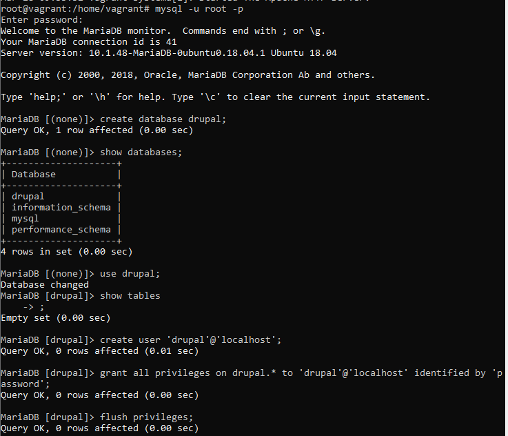

## Descargamos drupal y lo instalamos
	> wget https://www.drupal.org/download-latest/zip
	> unzip zip

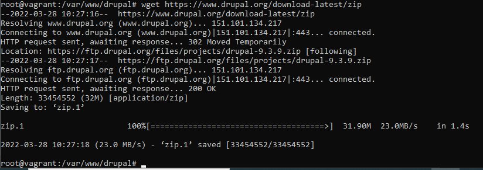

Configuramos virtualhost para que el servidor responda a la url drupal.miservidor.com

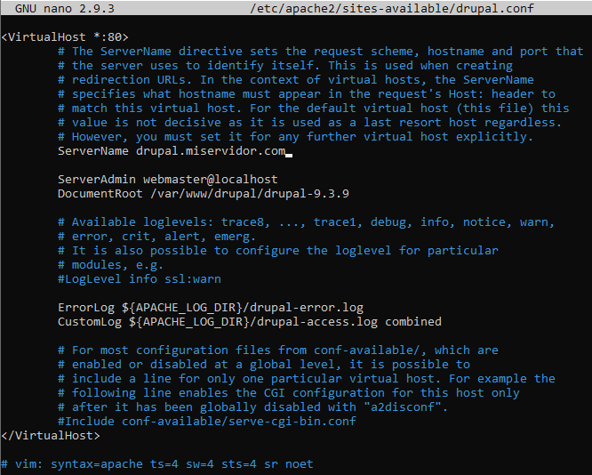

Habilitamos el nuevo sitio creado para poder acceder via navegador y reiniciamos Apache.

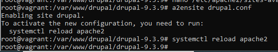

Actualizamos el fichero de hosts en Windows para poder acceder a nuestro servidor de forma local

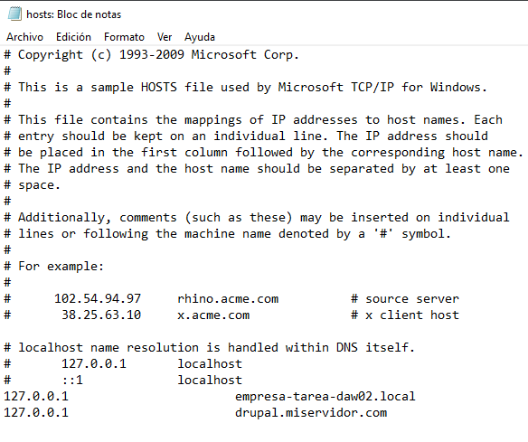

## Actualizamos la version de PHP porque hay incompatibilidad de versiones
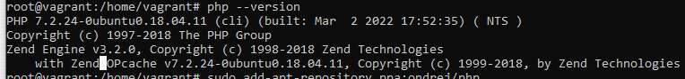

Añadimos el repositorio

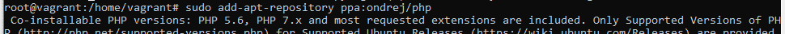

Actualizamos el repositorio

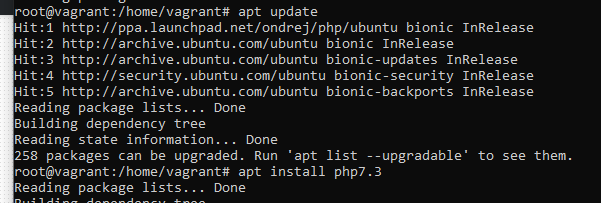

Deshabilitamos la version antigua de PHP y habilitamos la nueva, la 7.3

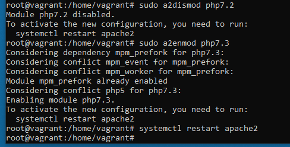

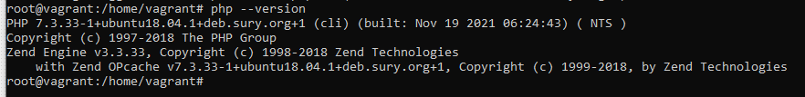

Pantalla de bienvenida a la instalacion de Drupal

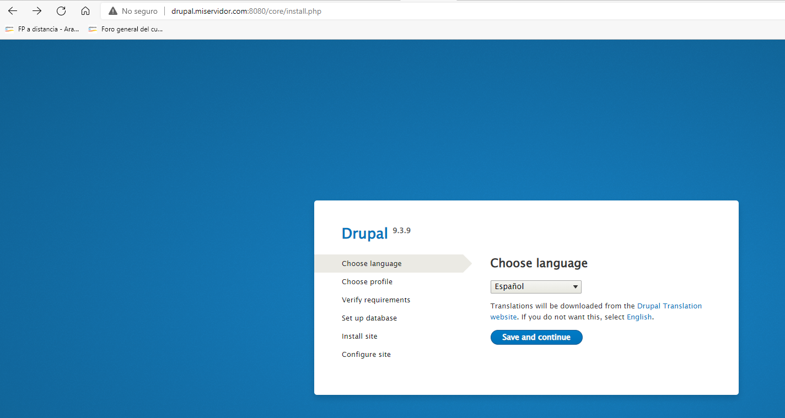

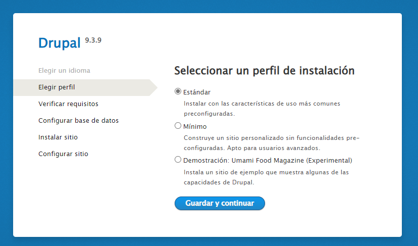

Para continuar nos pide instalar modulos adicionales que no estan incluidos en la instalacion por defecto de PHP, son: dom, xml, rewrite y simplexml

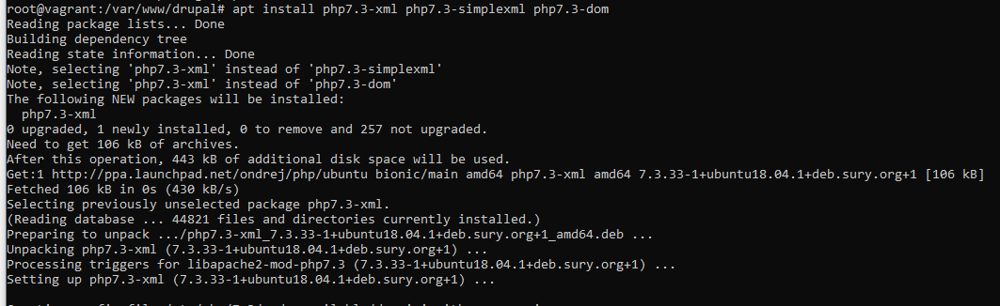

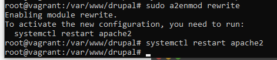

Configuramos nuestro virtualhost para aceptar URL limpias

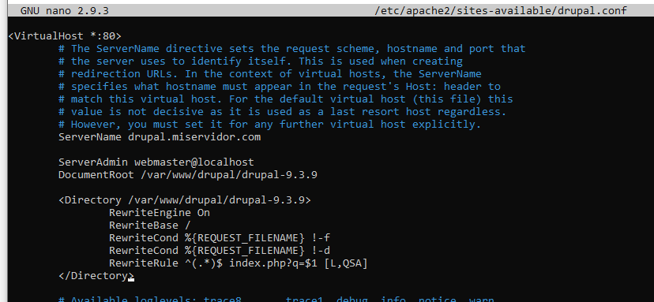

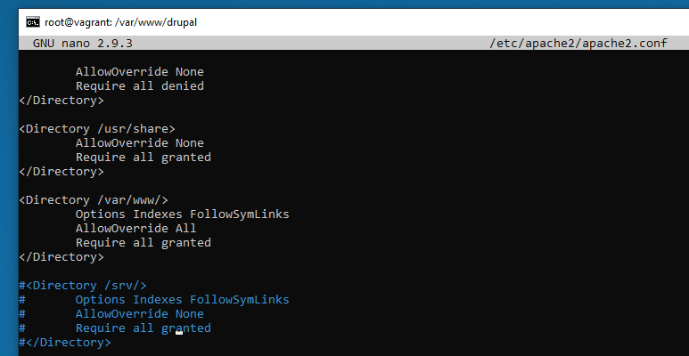

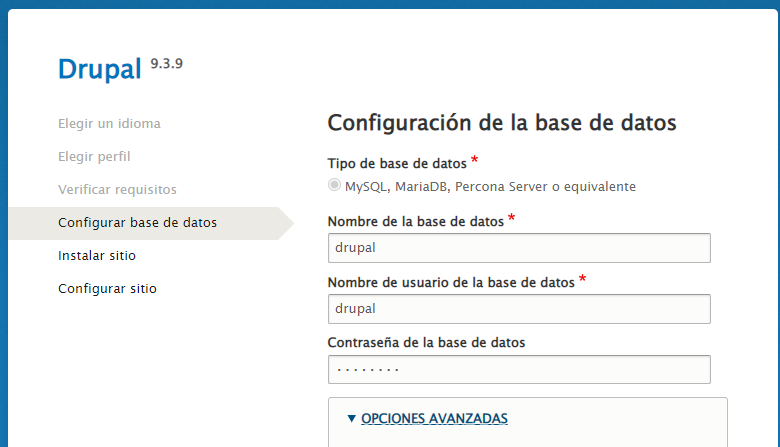

## Actualizamos la version de la base de datos porque hay incompatibilidad de versiones

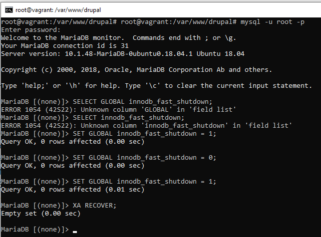

Desinstalamos la version antigua de mariadb

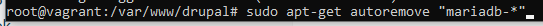

Descargamos la nueva version y ejecutamos el instalador despues de cambiar los permisos para hacer el instalador ejecutable

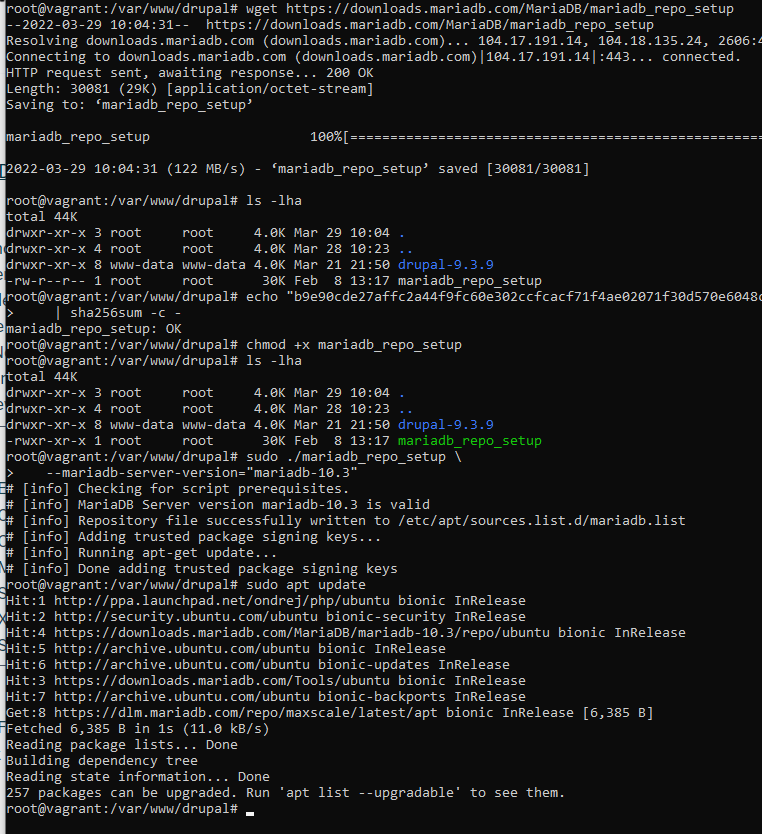

Instalamos la nueva version

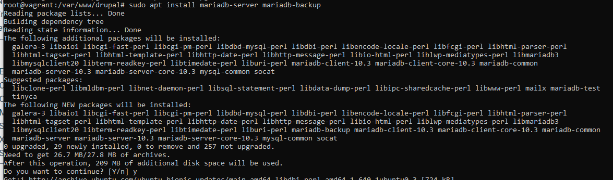

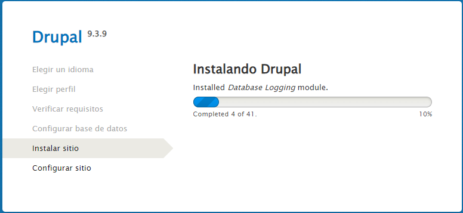

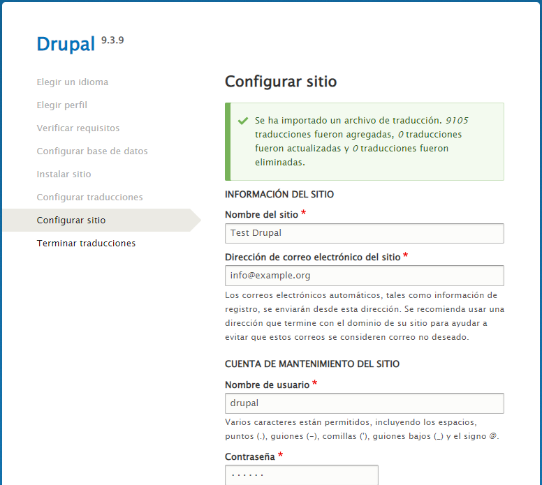

## Drupal se ha instalado correctamente
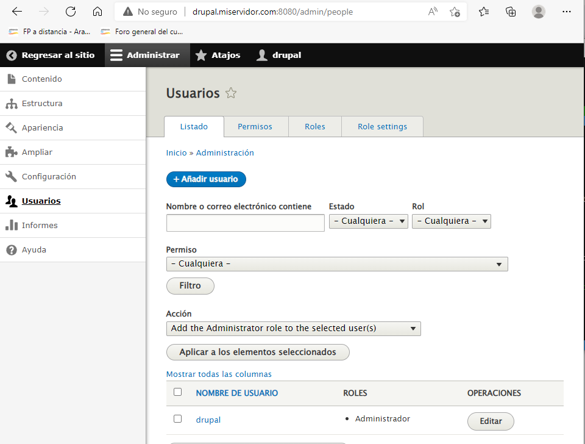

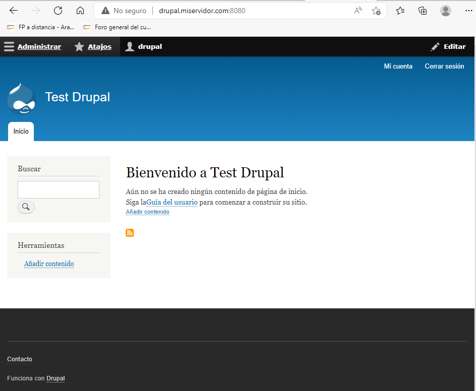
